

  <h3 align = "center" > 高清仪表盘图标 </h3>
  

    <!--  -->
      
      
      
  

  

  
  

  

      1024x1024 分辨率，已经过无损压缩处理。
  
    <a href="#圆角矩形图标"> <strong > 已有图标预览 »</strong> </a>
    <a href="https://github.com/xushier/HD-Icons/issues/new/choose"> <strong > 请求新图标 »</strong> </a>
  
  

  

  
  

# 目录
- [说明](#说明)
- [使用方法](#使用方法)
- [图标预览](#圆角矩形图标)
- [赞助](#赞助)
- [声明](#声明)

<!-- GETTING STARTED -->
# 说明

- 本项目建立初衷是为了用于 `Unraid Docker` 容器使用，当然，任何需要的地方也都可以用。
- 图标分辨率为 `1024x1024`。所有图标都已经过 **无损压缩** 处理。
- 图标主体适当放大，Unraid 系统上看起来图标主体更加突出。
- `border-radius` 文件夹包含圆角矩形图标，`circle` 文件夹包含圆形图标。
- 下面是几个常见的仪表盘程序，其中添加的链接可使用该项目图标。
  - [Dashy](https://github.com/Lissy93/dashy)
  - [Homer Dashboard](https://github.com/bastienwirtz/homer)
  - [Heimdall](https://github.com/linuxserver/Heimdall)
  - [Organizr(v2)](https://github.com/causefx/Organizr)
  - [Flame](https://github.com/pawelmalak/flame)
  - [SUI](https://github.com/jeroenpardon/sui)
- **需要使用新图标可以加微信、加 QQ 群或者发 `Issues` 申请，如果有能力做的就会添加。**<a href="https://github.com/xushier/HD-Icons/issues/new/choose"> <strong > 请求新图标 »</strong></a>
  - B站：煦诗儿<a href="https://space.bilibili.com/32313260"> <strong >前往 B 站 »</strong></a>
  - 公众号：小迪同学
  - QQ群：647605169
  - 微信群：dxyxddsbds，备注加群

# 使用方法

## 使用图标展示 docker，强烈推荐！！！

**项目地址：https://github.com/xushier/HD-Icons-docker**
**使用方法见项目详情。预览图如下：**

#### 日间模式

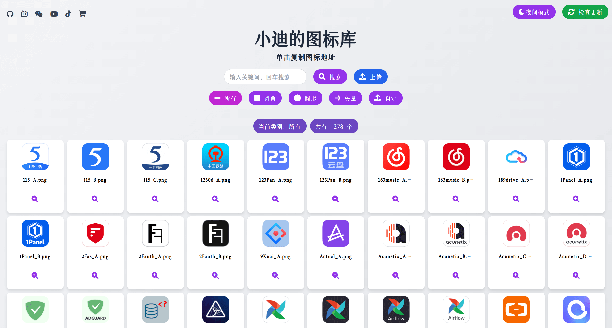

#### 夜间模式

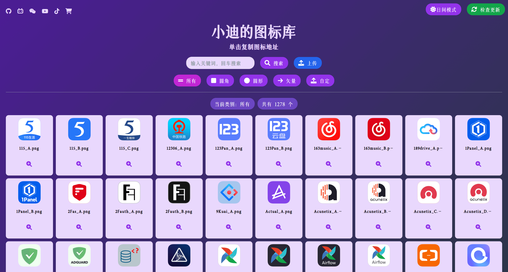

#### 移动端自适应

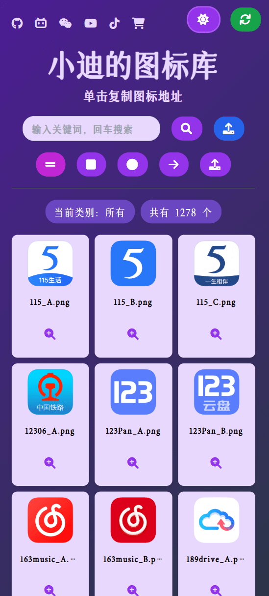

#### 单击复制地址

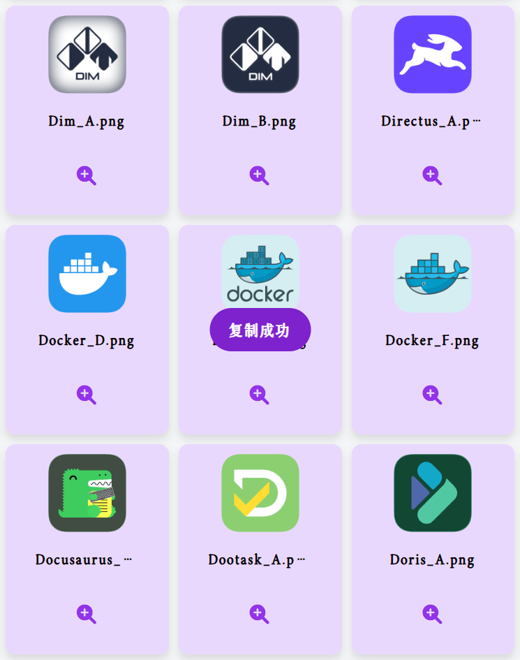

#### 自定义图片上传

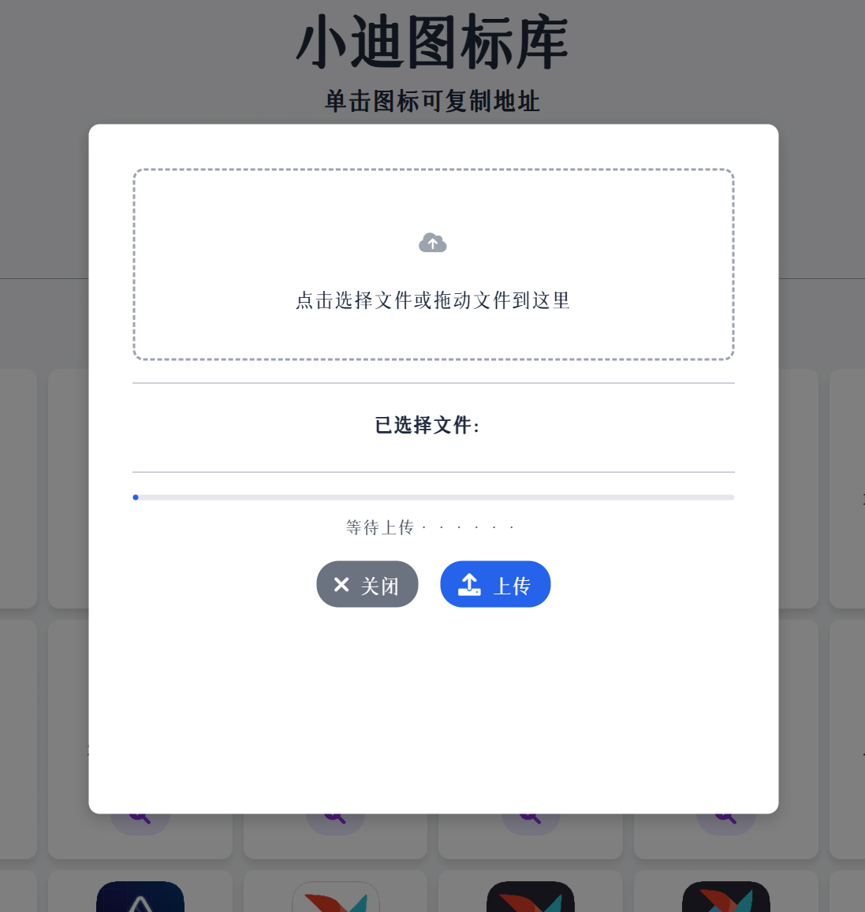

## 使用远程链接（后续更新同步显示，推荐）

1. 使用 Github 原始的图标链接，适用于可以访问 Github 的用户。
   - Github 项目地址：https://github.com/xushier/HD-Icons
   - 例如：`https://raw.githubusercontent.com/xushier/HD-Icons/main/border-radius/xxxxx.png`

2. 使用代理或 CDN 加速地址，适用于不能访问 Github 但想要使用 Github 图标源的用户。
   - 例如：`https://cdn.jsdelivr.net/gh/xushier/HD-Icons/border-radius/xxxxx.png`

注：将以上地址最后的 xxxxx 换成对应的图标名称即可。<a href="#圆角矩形图标"><strong>图标名称预览在此 »</strong></a>

# 图标预览（当前共计 1287 个）
## 圆角矩形图标
<!-- START BORDER-RADIUS ICONS -->
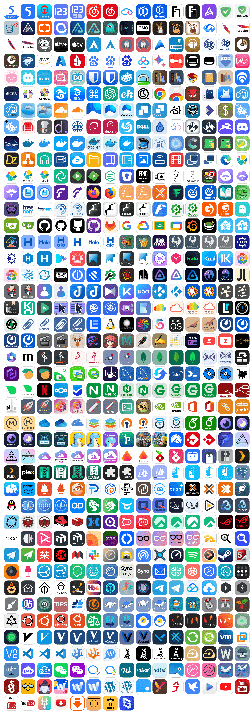
<!-- END BORDER-RADIUS ICONS -->

## 圆形图标
<!-- START CIRCLE ICONS -->
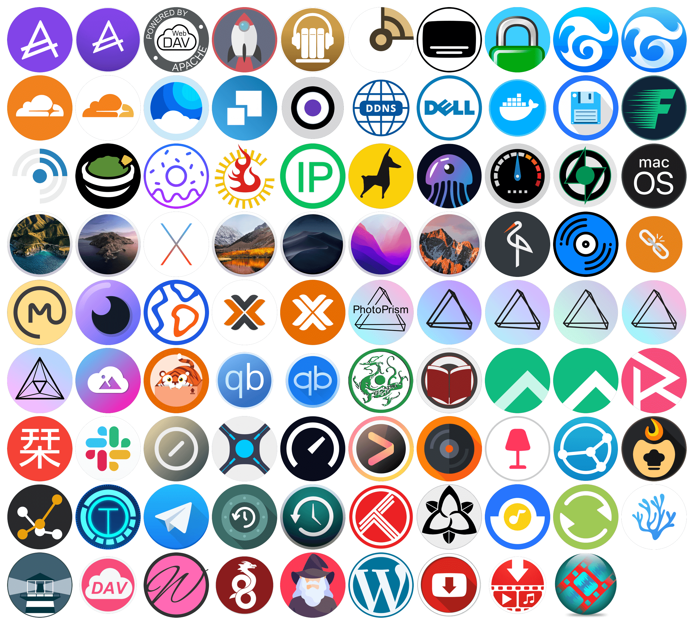
<!-- END CIRCLE ICONS -->

## SVG 图标
<!-- START SVG ICONS -->

<!-- END SVG ICONS -->
 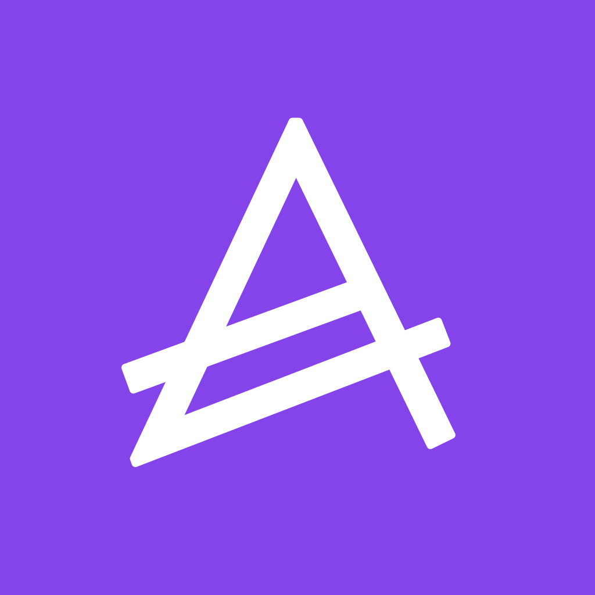                                                   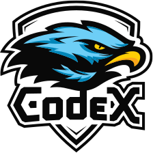        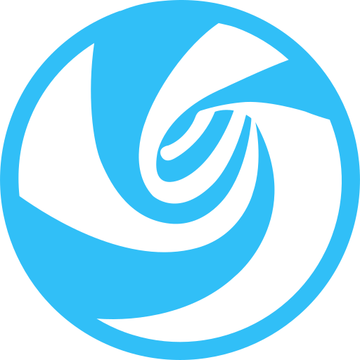   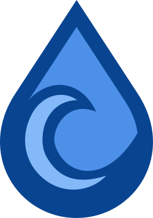    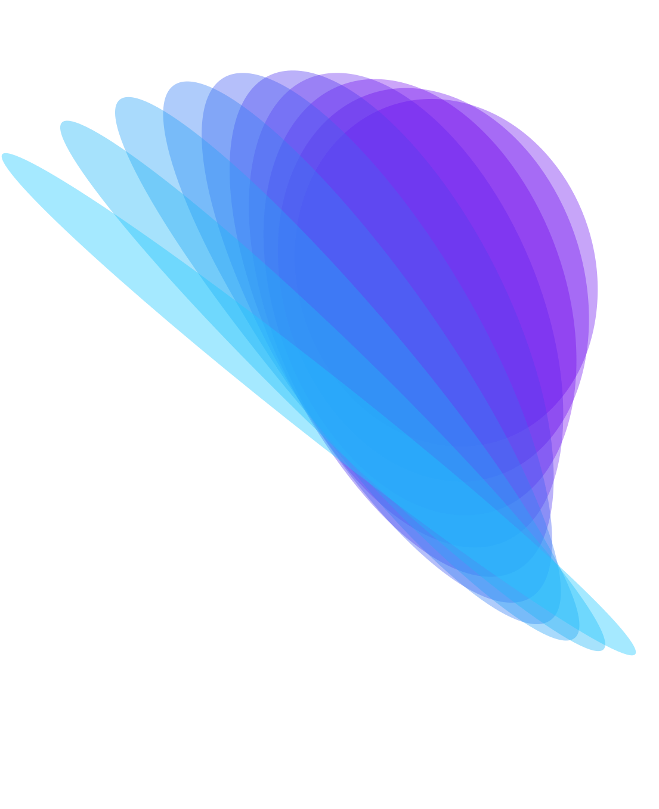    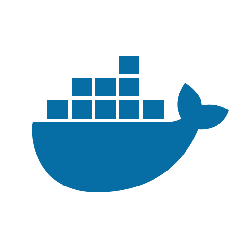                     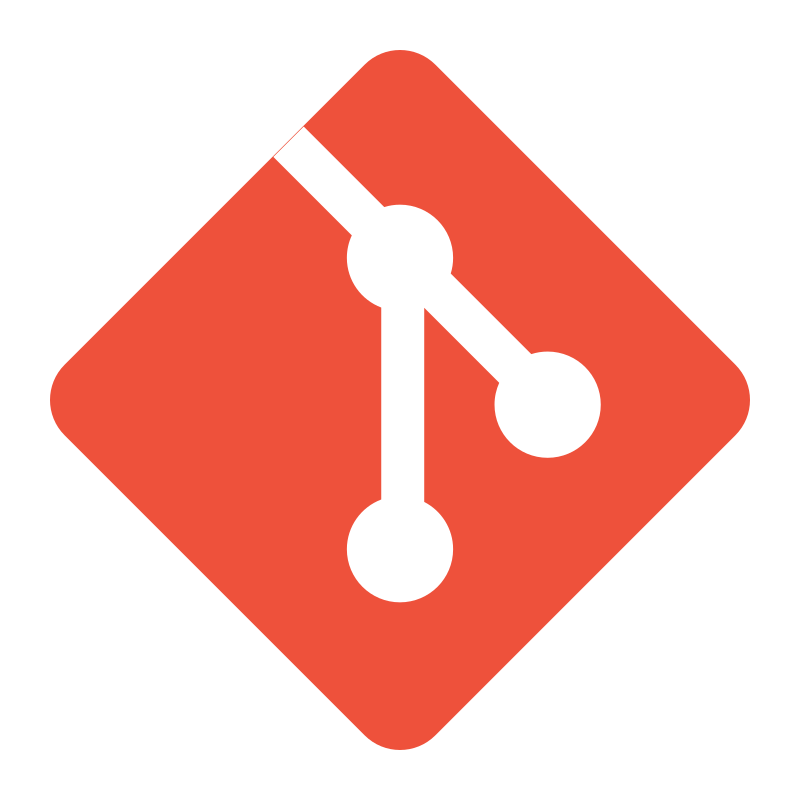  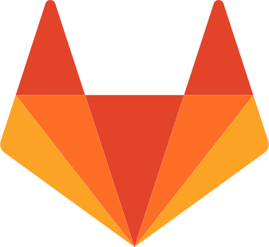             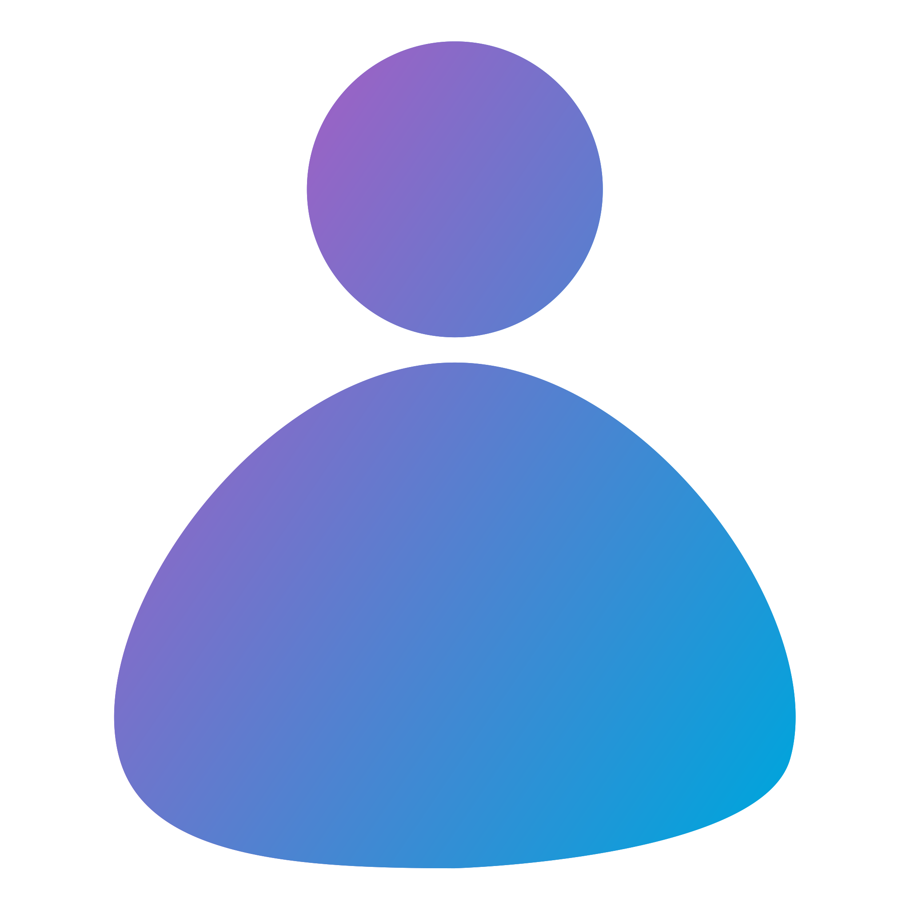 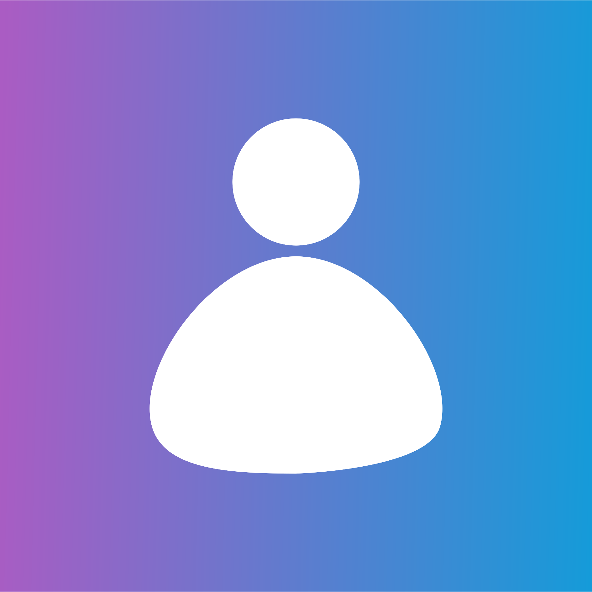                                                                  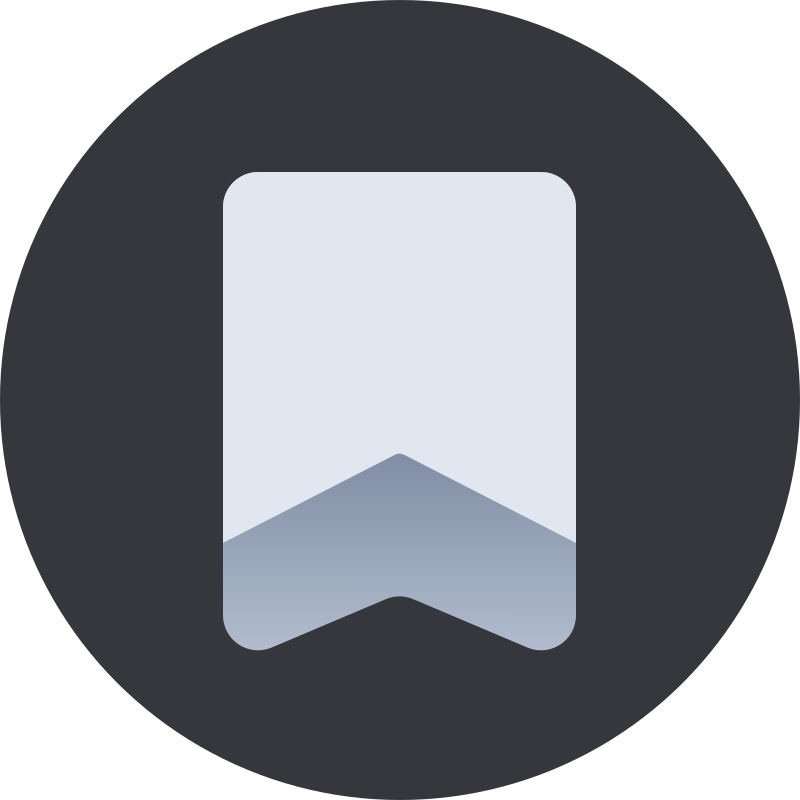                                                                 

<!-- LEGAL -->

# 赞助（备注：图标）

# 声明
(Almost) All product names, trademarks and registered trademarks in the images in this repository, are property of their respective owners. All images in this repository are used by the users of the Dashboard Icons project for identification purposes only.

The use of these names, trademarks and brands appearing in these image files, do not imply endorsement.

---

