

  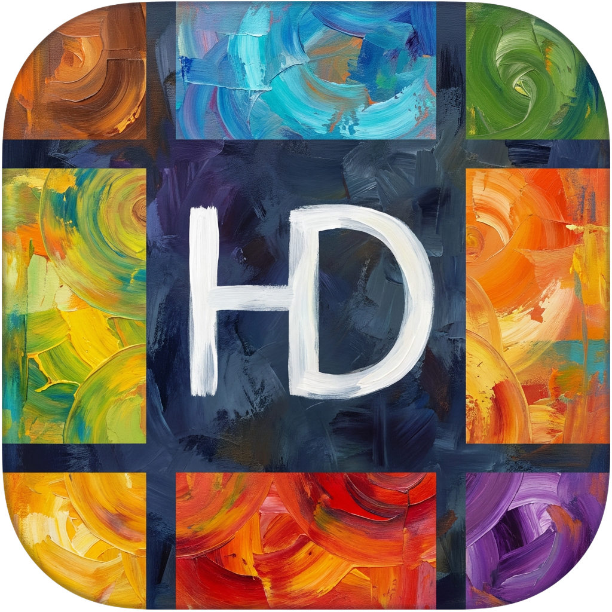
  <h1>HD-Icons：高清仪表盘图标</h1>
  
<em>1024×1024 超清分辨率 · 无损压缩优化 · 多种样式适配</em>

  <!-- 徽章区域 -->
  
  
  
  

  <!-- 统计信息 -->
  
  
  

  <!-- CDN 徽章 -->
  

  <!-- 快速导航 -->
  

    <a href="#-项目简介"><strong>📖 项目简介</strong></a> •
    <a href="#-使用说明三种方式"><strong>🚀 使用说明</strong></a> •
    <a href="#-图标预览"><strong>✨ 图标预览</strong></a> •
    <a href="https://github.com/xushier/HD-Icons/issues/new/choose"><strong>🎯 请求图标</strong></a>
  

  <!-- 活动图表 -->
  

    
  

<!-- GETTING STARTED -->

## 📝 项目简介

> 🎯 **使命**：为 Unraid Docker 容器和各类仪表盘应用提供高质量、标准化的图标解决方案

### ✨ 核心特性

| 特性 | 描述 |
|------|-----|
| 🖼️ **超清分辨率** | 1024×1024 像素，确保在任何尺寸下都清晰锐利 |
| 🗜️ **无损压缩** | 所有图标经过无损压缩，体积更小，质量不变 |
| 🎨 **优化显示** | 图标主体适当放大，满足各种使用场景 |
| 📁 **多样样式** | 提供 `border-radius`（圆角矩形）、 `circle`（圆形）和 `svg`（矢量）三种风格 |
| 🔄 **持续更新** | 不定期添加新图标，满足不断增长的需求 |

### 🎯 适用场景

本项目最初为 `Unraid Docker` 容器图标展示而设计，现已扩展支持多种仪表盘应用、部分APP及其他用途：

| 应用程序 | 描述 | 链接 | 备注 |
|----------|------|------|------|
| **FlatNas** | 新晋现代化仪表盘 | [🔗](https://github.com/Garry-QD/FlatNas) | 开源免费 |
| **Sun-Panel** | 适合国人体质的现代化仪表盘 | [🔗](https://github.com/hslr-s/sun-panel) | 1.3.0及之前版本开源，新版Pro授权99永久 |
| **Dashy** | 现代化仪表盘 | [🔗](https://github.com/Lissy93/dashy) | 开源免费 |
| **Homer Dashboard** | 简洁的静态主页 | [🔗](https://github.com/bastienwirtz/homer) | 开源免费 |
| **Heimdall** | 应用程序仪表盘 | [🔗](https://github.com/linuxserver/Heimdall) | 开源免费 |
| **Organizr(v2)** | 组织管理工具 | [🔗](https://github.com/causefx/Organizr) | 开源免费 |
| **Flame** | 自托管仪表盘 | [🔗](https://github.com/pawelmalak/flame) | 开源免费 |
| **SUI** | 简单用户界面 | [🔗](https://github.com/jeroenpardon/sui) | 开源免费 |

### 🌟 社区支持

| 平台 | 账号/群组 | 链接 |
|------|-----------|------|
| **B站** | 小迪课代表 | [🎬 传送门](https://space.bilibili.com/32313260) |
| **公众号** | 小迪同学 | 📱 微信搜索关注 |
| **QQ群** | 647605169 | 💬 加入讨论 |
| **微信群** | dxyxddsbds（备注加群） | 📱 添加微信入群 |

> 💡 **需要新图标？** [点击这里提交请求](https://github.com/xushier/HD-Icons/issues/new/choose) 🎯

## 📖 使用说明（三种方式）

### 🐳 Docker 部署图标展示容器使用（强烈推荐）

> 🚀 **项目地址**：[HD-Icons-docker](https://github.com/xushier/HD-Icons-docker)
> 
> 💡 **优势**：自动同步更新、一键复制、移动端适配、自定义上传

#### 🌟 功能展示

| 功能 | 预览 |
|------|------|
| **☀️ 日间模式** |  |
| **🌙 夜间模式** |  |
| **📱 移动端适配** |  |
| **📋 一键复制** |  |
| **📤 自定义上传** |  |

### 🔗 远程链接使用（自动同步更新）

#### 📋 GitHub 原始链接

> 🌐 **适用场景**：可直接访问 GitHub 的用户
> 
> 📝 **格式**：`https://raw.githubusercontent.com/xushier/HD-Icons/main/border-radius/图标名称.png`
> 
> 🔗 **项目地址**：[HD-Icons](https://github.com/xushier/HD-Icons)

#### ⚡ CDN 加速链接

> 🚀 **适用场景**：无法直接访问 GitHub 但需要使用 GitHub 图标源的用户
> 
> 📝 **格式**：`https://cdn.jsdelivr.net/gh/xushier/HD-Icons/border-radius/图标名称.png`
> 
> 💡 **优势**：全球 CDN 加速，访问速度更快

> 📌 **使用提示**：将上述链接中的 `图标名称` 替换为实际图标文件名即可。[📋 查看所有图标](#-图标预览)

### 📱 移动应用使用

> 🎯 **支持应用**：Yamby、Hills 等安卓 APP
> 
> 📦 **图标包地址**：`https://raw.githubusercontent.com/xushier/HD-Icons/main/icons.json`
> 
> ⚠️ **注意**：如无响应，请开启代理环境或自行部署
> 
> 🚀 **自部署方案**：[HD-Icons-docker](https://github.com/xushier/HD-Icons-docker)

## ✨ 图标预览

> 🎨 **持续更新中**：当前共计 1754 个，数量不断增加，欢迎提交新图标请求
### 📦 圆角矩形图标

  

### ⭕ 圆形图标

  

### 🎨 SVG 矢量图标

<!-- SVG 图标预览区域 -->

<!-- 此处将自动生成 SVG 图标预览 -->
                   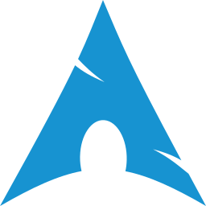                                                             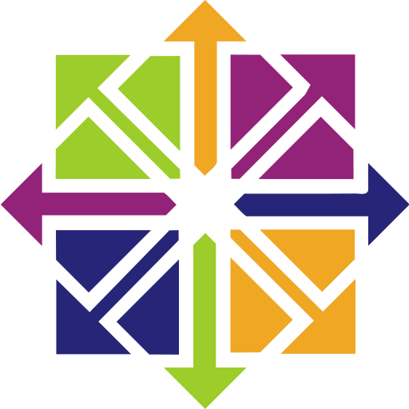                       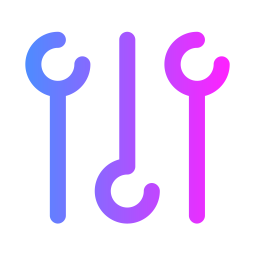                                      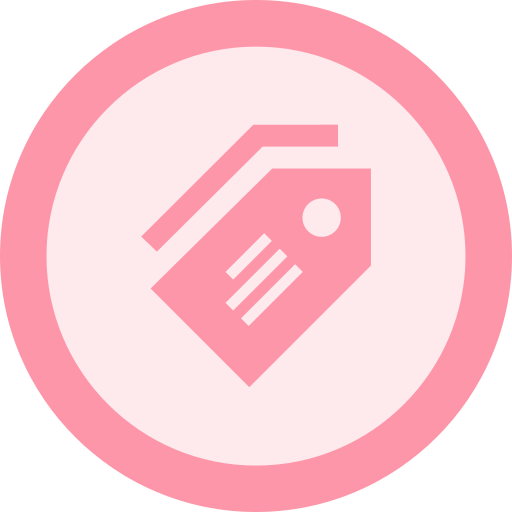                                                           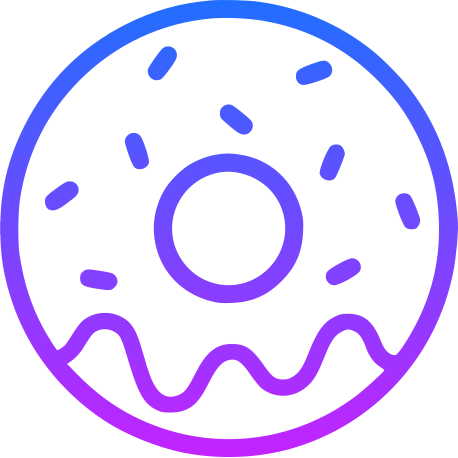                               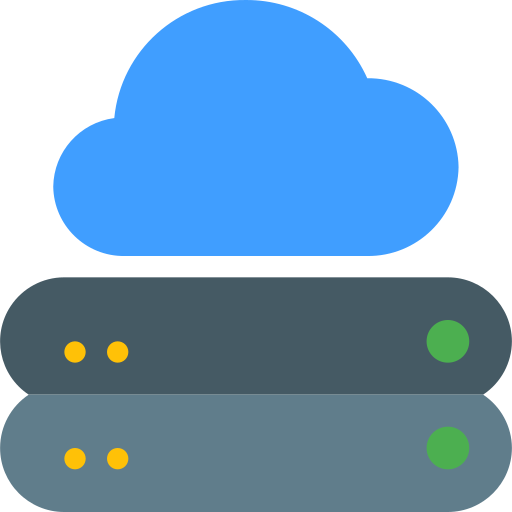                                       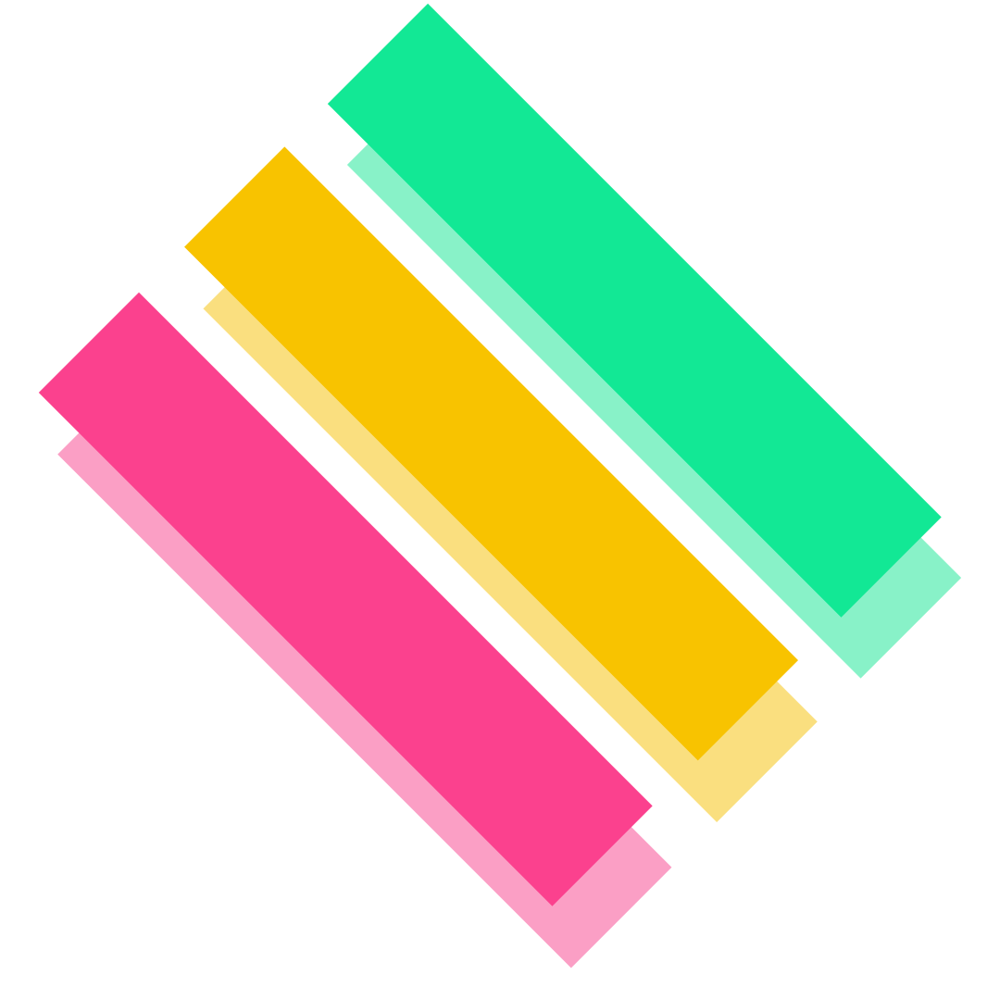       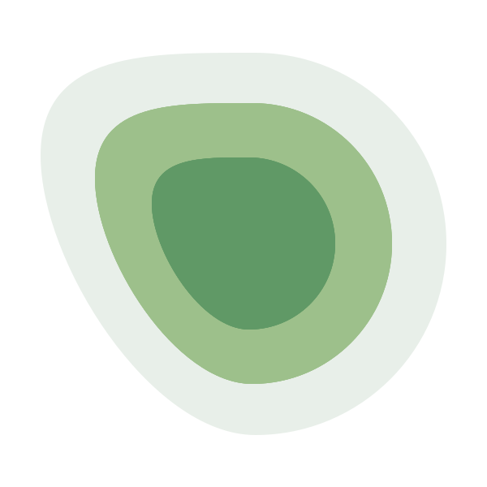                                 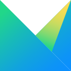                                                                                                                                                    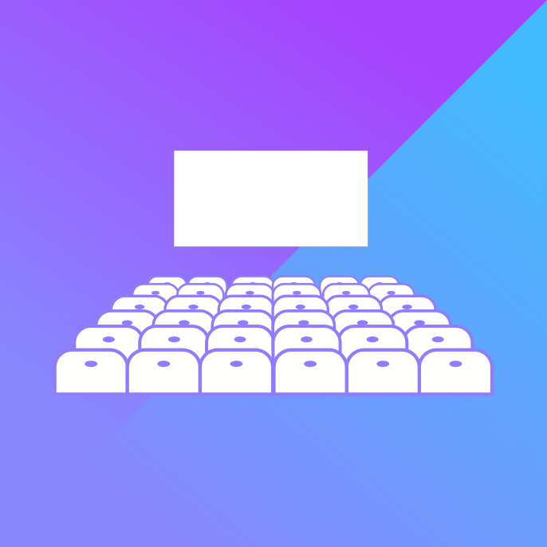 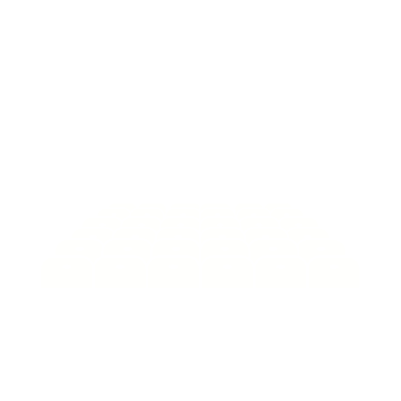                                                                                       

<!-- LEGAL -->

---

## 🤝 支持与赞助

  
<strong>！！！项目批量使用请告知！！！</strong>

  
<strong>💝 感谢您的支持，让这个项目持续发展！</strong>

  <table>
    <tr>
      <td align="center">
        
        
<strong>支付宝</strong>

      </td>
      <td align="center">
        
        
<strong>微信支付</strong>

      </td>
    </tr>
  </table>

  
<em>赞助时请备注「图标」，感谢您的慷慨支持！</em>

## 📜 免责声明

> ⚖️ **法律声明**：本仓库中图像的（几乎）所有产品名称、商标和注册商标均为其各自所有者的财产。仪表盘导航用户仅将本仓库中的所有图像用于识别目的。
> 
> 📝 **使用说明**：这些图像文件中出现的名称、商标和品牌的使用不表示认可。

---

### 🌟 项目统计

### 📊 项目活跃度

---

  
<strong>🎯 如果这个项目对您有帮助，请给个 ⭐ Star 支持一下！</strong>

  
<em>Made with ❤️ by xushier</em>

