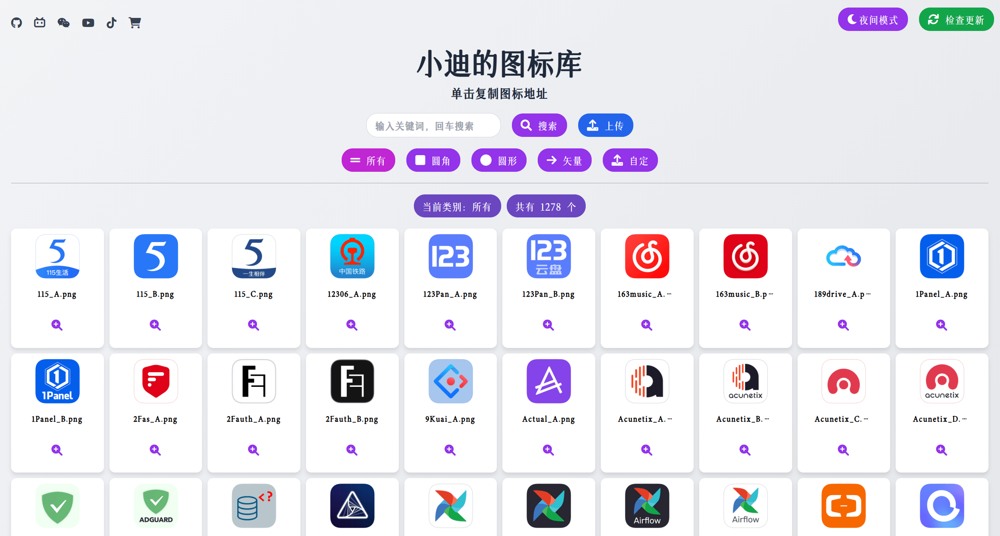
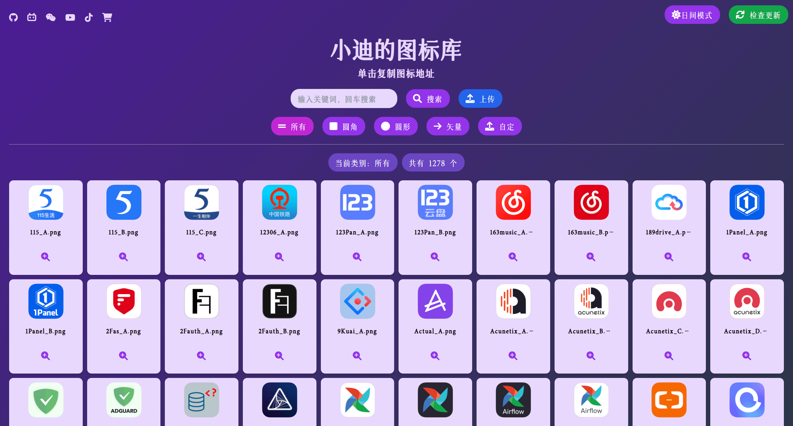
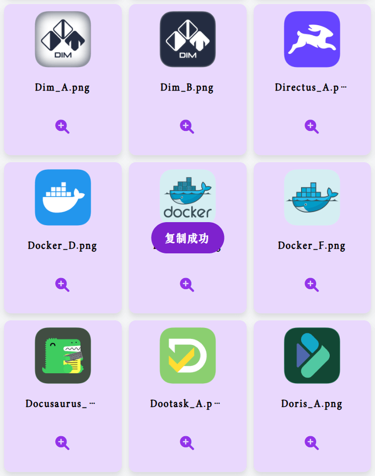
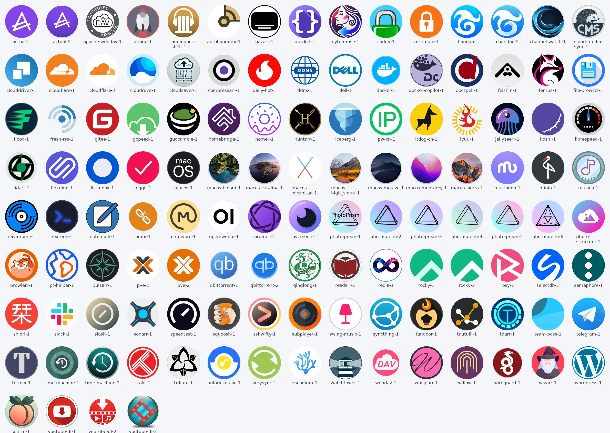
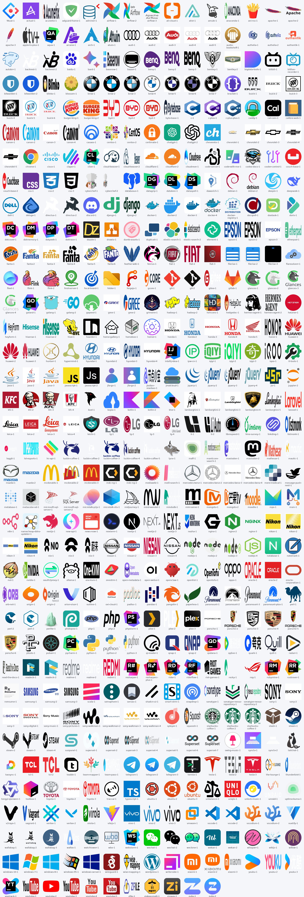

<div align="center">
  

# HD-Icons

**为仪表盘而生的高清图标库**

1024×1024 超清导出 · TinyPNG 无损压缩 · 圆角矩形 / 圆形 / SVG 三种风格

[](https://github.com/xushier/HD-Icons/stargazers)
[](https://github.com/xushier/HD-Icons/blob/master/LICENSE)
[](https://github.com/xushier/HD-Icons/commits/main)
[](https://www.jsdelivr.com/package/gh/xushier/HD-Icons)

**共 <!--ICONS:total-->1811<!--/ICONS:total--> 个图标，持续更新中**
</div>

---

## ✨ 特性

- **超清分辨率** — 所有 PNG 均为 1024×1024，任意缩放依旧锐利
- **无损压缩** — 每张图标经 TinyPNG 压缩，体积更小、画质不变
- **三种风格** — 圆角矩形、圆形（PNG）与矢量（SVG），命名一一对应
- **自动构建** — 新图标入库后，索引、预览图、数量统计全部自动更新

## 📊 图标统计

| 风格 | 目录 | 数量 |
|------|------|------|
| 📦 圆角矩形 | `border-radius/` | <!--ICONS:radius-->1083<!--/ICONS:radius--> |
| ⭕ 圆形 | `circle/` | <!--ICONS:circle-->124<!--/ICONS:circle--> |
| 🎨 SVG 矢量 | `svg/` | <!--ICONS:svg-->604<!--/ICONS:svg--> |

## 🚀 使用

### 方式一：Docker 图标站（推荐）

部署 [HD-Icons-docker](https://github.com/xushier/HD-Icons-docker)，自动同步本仓库更新，支持一键复制、移动端适配与自定义上传。

<details open>
<summary>☀️ 日间模式 / 🌙 夜间模式</summary>

| 日间模式 | 夜间模式 |
|----------|----------|
|  |  |

</details>

<details open>
<summary>📱 移动端适配 / 一键复制 / 自定义上传</summary>

| 移动端自适应 | 一键复制地址 | 自定义上传 |
|----------|----------|----------|
|  |  |  |

</details>

### 方式二：直链引用

GitHub Raw（可直连 GitHub 时使用）：

```
https://raw.githubusercontent.com/xushier/HD-Icons/main/border-radius/图标名.png
```

jsDelivr CDN（无法直连 GitHub 或需要加速时使用）：

```
https://cdn.jsdelivr.net/gh/xushier/HD-Icons/border-radius/图标名.png
```

把 `图标名` 替换为实际文件名（可在 [icons.json](icons.json) 或下方预览图中查找），目录按需替换为 `border-radius`、`circle` 或 `svg`。

### 方式三：App 图标包

Yamby、Hills 等安卓应用可直接订阅图标索引：

```
https://raw.githubusercontent.com/xushier/HD-Icons/main/icons.json
```

> 如无响应，请开启代理环境，或使用 [HD-Icons-docker](https://github.com/xushier/HD-Icons-docker) 自行部署。

## 🖼️ 图标预览

<details open>
<summary>📦 圆角矩形（<!--ICONS:radius-->1083<!--/ICONS:radius-->）</summary>
<div align="center">
  
</div>
</details>

<details open>
<summary>⭕ 圆形（<!--ICONS:circle-->124<!--/ICONS:circle-->）</summary>
<div align="center">
  
</div>
</details>

<details open>
<summary>🎨 SVG 矢量（<!--ICONS:svg-->604<!--/ICONS:svg-->）</summary>
<div align="center">
  
</div>
</details>

## 🎯 请求与贡献图标

- 缺少你需要的图标？[提交 Issue](https://github.com/xushier/HD-Icons/issues/new/choose) 即可
- 想贡献图标？Fork 本仓库，把做好的图标（1024×1024 PNG 或 SVG）放进 `inbox/` 对应子目录，提交 PR，压缩入库、索引更新、预览图生成全部自动完成
- 命名规范：小写英文单词 + 连字符 + 序号，如 `google-map-1.png`

<details open>
<summary>📖 适用场景</summary>

本项目最初为 Unraid Docker 容器图标展示而设计，现已扩展支持多种仪表盘应用、部分 App 及其他用途：

| 应用程序 | 描述 | 链接 | 备注 |
|----------|------|------|------|
| **FlatNas** | 新晋现代化仪表盘 | [🔗](https://github.com/Garry-QD/FlatNas) | 开源免费 |
| **Sun-Panel** | 适合国人体质的现代化仪表盘 | [🔗](https://github.com/hslr-s/sun-panel) | 1.3.0 及之前版本开源，新版 Pro 授权 99 永久 |
| **Dashy** | 现代化仪表盘 | [🔗](https://github.com/Lissy93/dashy) | 开源免费 |
| **Homer Dashboard** | 简洁的静态主页 | [🔗](https://github.com/bastienwirtz/homer) | 开源免费 |
| **Heimdall** | 应用程序仪表盘 | [🔗](https://github.com/linuxserver/Heimdall) | 开源免费 |
| **Organizr(v2)** | 组织管理工具 | [🔗](https://github.com/causefx/Organizr) | 开源免费 |
| **Flame** | 自托管仪表盘 | [🔗](https://github.com/pawelmalak/flame) | 开源免费 |
| **SUI** | 简单用户界面 | [🔗](https://github.com/jeroenpardon/sui) | 开源免费 |

</details>

<details open>
<summary>💬 社区</summary>

| 平台 | 账号/群组 | 链接 |
|------|-----------|------|
| **B站** | 小迪课代表 | [🎬 传送门](https://space.bilibili.com/32313260) |
| **公众号** | 小迪同学 | 📱 微信搜索关注 |
| **QQ群** | 647605169 | 💬 加入讨论 |
| **微信群** | dxyxddsbds（备注加群） | 📱 添加微信入群 |

</details>

## 🤝 支持与赞助

<div align="center">

**！！！项目批量使用请告知！！！**

**💝 感谢您的支持，让这个项目持续发展！**

| 支付宝 | 微信支付 |
|--------|----------|
|  |  |

<em>赞助时请备注「图标」，感谢您的慷慨支持！</em>

</div>

<details>
<summary>📜 免责声明</summary>

> ⚖️ **法律声明**：本仓库中图像的（几乎）所有产品名称、商标和注册商标均为其各自所有者的财产。仪表盘导航用户仅将本仓库中的所有图像用于识别目的。
>
> 📝 **使用说明**：这些图像文件中出现的名称、商标和品牌的使用不表示认可。

</details>

## ⭐ 支持这个项目

<div align="center">

如果这个项目对您有帮助，请给个 ⭐ Star 支持一下！

📈 完整 Star 增长曲线请查看 [Star History](https://star-history.com/#xushier/HD-Icons&Date)

<sub>Made with ❤️ by xushier</sub>

</div>
